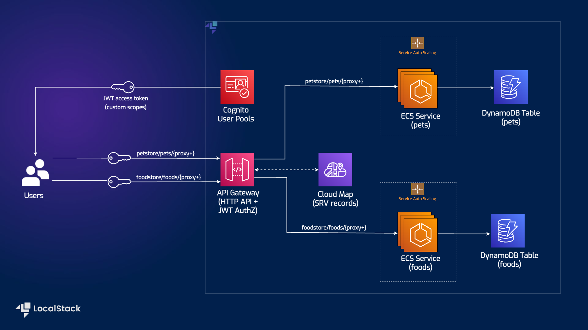
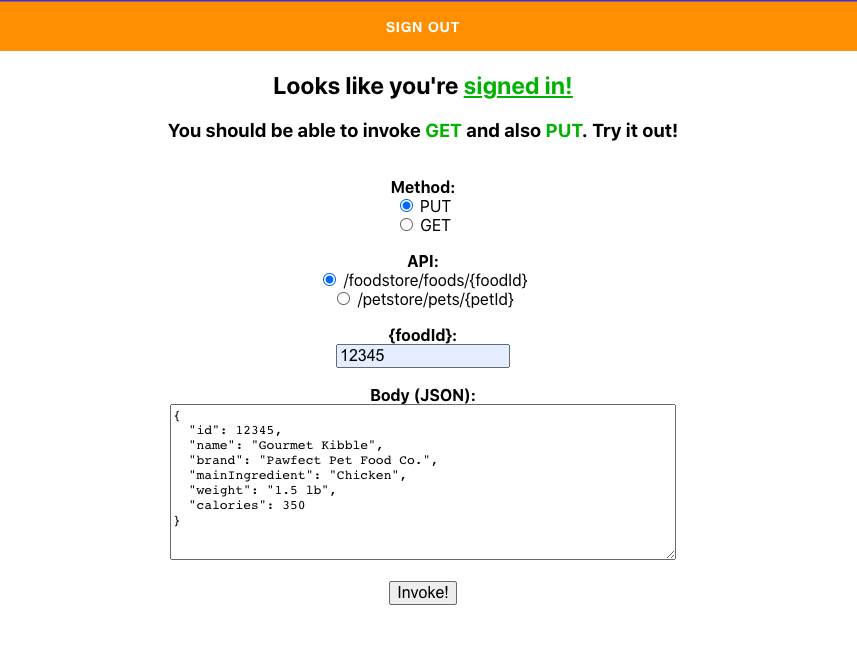
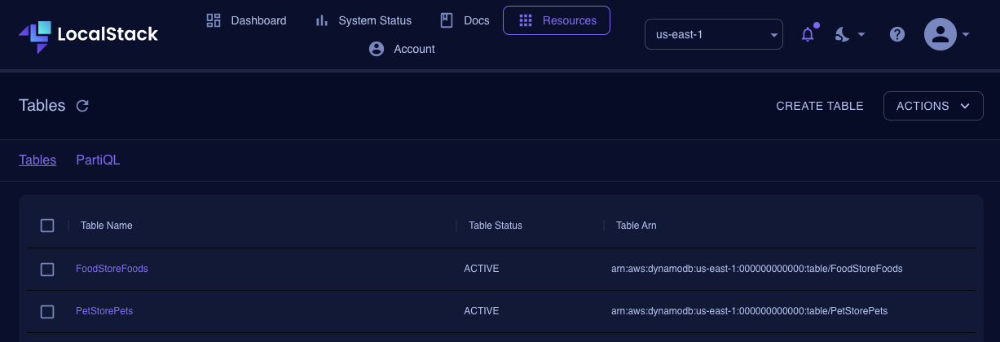
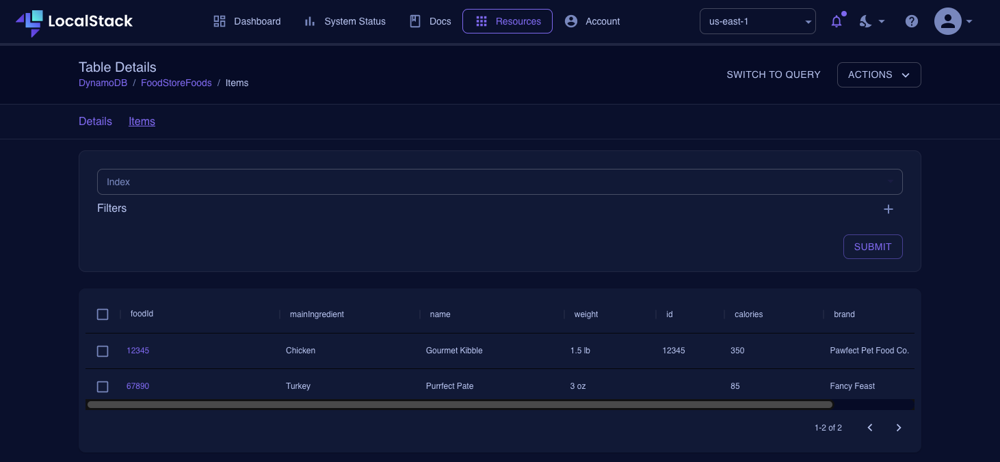

# Serverless Container-based APIs with Amazon ECS and Amazon API Gateway

| Key          | Value                                                                                 |
| ------------ | ------------------------------------------------------------------------------------- |
| Environment  |                                                                       |
| Services     | S3, DynamoDB, Elastic Container Service, API Gateway, Cognito, IAM                    |
| Integrations | Terraform, CloudFormation, AWS CLI                                                    |
| Categories   | Serverless; Containers; Security, Identity, and Compliance                            |
| Level        | Intermediate                                                                          |
| GitHub       | [Repository link](https://github.com/localstack/serverless-api-ecs-apigateway-sample) |

## Introduction

The Serverless Container-based APIs with Amazon ECS and Amazon API Gateway application sample demonstrate how you can launch and test a sample container-based API. This application sample implements an example API with two services — “Food store” to `PUT` & `GET` foods, and “Pet store” to `PUT` & `GET` pets. The application client is implemented using ReactJS, which allows unauthenticated users to use only `GET` requests, while authenticated users can utilize `GET` and `PUT` requests. Users can deploy this application sample on AWS & LocalStack using CloudFormation & Terraform with minimal changes. To test this application sample, we will demonstrate how you use LocalStack to deploy the infrastructure on your developer machine and your CI environment.

## Architecture diagram

The following diagram shows the architecture that this sample application builds and deploys:



We are using the following AWS services and their features to build our infrastructure:

- [Elastic Container Service](https://docs.localstack.cloud/user-guide/aws/elastic-container-service/) to create and deploy our containerized application.
- [DynamoDB](https://docs.localstack.cloud/user-guide/aws/dynamodb/) as a key-value and document database to persist our data.
- [API Gateway](https://docs.localstack.cloud/user-guide/aws/apigatewayv2/) to expose the containerized services to the user through HTTP APIs.
- [Cognito User Pools](https://docs.localstack.cloud/user-guide/aws/cognito/) for user authentication and authorizing requests to container APIs.
- [Amplify](https://docs.localstack.cloud/user-guide/aws/amplify/) to create the user client with ReactJS to send requests to container APIs.
- [S3](https://docs.localstack.cloud/user-guide/aws/s3/) to deploy the Amplify application to make the web application available to users.
- [IAM](https://docs.localstack.cloud/user-guide/aws/iam/) to create policies to specify roles and permissions for various AWS services.

## Prerequisites

- LocalStack Pro with the [`localstack` CLI](https://docs.localstack.cloud/getting-started/installation/#localstack-cli).
- [AWS CLI](https://docs.localstack.cloud/user-guide/integrations/aws-cli/) with the [`awslocal` wrapper](https://docs.localstack.cloud/user-guide/integrations/aws-cli/#localstack-aws-cli-awslocal).
- [Terraform](https://docs.localstack.cloud/user-guide/integrations/terraform/) with the [`tflocal` wrapper](https://docs.localstack.cloud/user-guide/integrations/terraform/#using-the-tflocal-script).
- [Node.js](https://nodejs.org/en/download/) with `npm` package manager.

Start LocalStack Pro with the appropriate configuration to enable the S3 website to send requests to the container APIs:

```shell
export LOCALSTACK_AUTH_TOKEN=<your-auth-token>
EXTRA_CORS_ALLOWED_ORIGINS=http://sample-app.s3.localhost.localstack.cloud:4566 DISABLE_CUSTOM_CORS_APIGATEWAY=1 DEBUG=1 localstack start
```

The `DISABLE_CUSTOM_CORS_APIGATEWAY` configuration variable disables CORS override by API Gateway. The `EXTRA_CORS_ALLOWED_ORIGINS` configuration variable allows our website to send requests to the container APIs.
We specified DEBUG=1 to get the printed LocalStack logs directly in the terminal (it helps later, when we need to get the Cognito confirmation code).
If you prefer running LocalStack in detached mode, you can add the `-d` flag to the `localstack start` command, and use Docker Desktop to view the logs.

## Instructions

You can build and deploy the sample application on LocalStack by running our `Makefile` commands. Run `make terraform-setup` or `make cloudformation-setup` to create the infrastructure on LocalStack. 
Run `make run` to deploy the S3 Website and get a URL to access the application. Run `make stop` to delete the infrastructure by stopping LocalStack.

Alternatively, here are instructions to deploy it manually step-by-step.

## Creating the infrastructure

To create the AWS infrastructure locally, you can either use Terraform or CloudFormation.

### Terraform

To create the infrastructure using Terraform, run the following commands:

```shell
cd terraform
tflocal init
tflocal apply --auto-approve
```

We are using the `tflocal` wrapper to configure the local service endpoints, and send the API requests to LocalStack, instead of AWS. You can use the same Terraform configuration to deploy the infrastructure on AWS as well.

> Currently, the Terraform configuration is tested & validated against `localstack/localstack:3.2.0` image. You can use the `IMAGE_NAME` environment variable to specify the LocalStack image version to ensure that the Terraform configuration works as expected.

#### CloudFormation

To create the infrastructure using CloudFormation, run the following commands:

```shell
cd cloudformation
export STACK="stack1"
awslocal cloudformation create-stack --stack-name $STACK --template-body file://ecsapi-demo-cloudformation.yaml
```

Wait for a few seconds for the infrastructure to be created. You can check the status of the stack using the following command:

```shell
awslocal cloudformation describe-stacks --stack-name $STACK | grep StackStatus
```

If the `StackStatus` is `CREATE_COMPLETE`, you can proceed to the next step.

## Building the web application

To build the web application, navigate to the root directory of the sample application and run the following commands:

```shell
cd client-application-react
yarn
NODE_OPTIONS=--openssl-legacy-provider yarn build
```

Ensure a `build` directory is created in the `client-application-react` directory.

## Deploying the web application

To deploy the web application, we will make an S3 bucket and sync the `build` directory to the S3 bucket. Run the following commands from the `client-application-react` directory:

```shell
awslocal s3 mb s3://sample-app
awslocal s3 sync build s3://sample-app
```

To access the web application, you can run the following commands:

```shell
export API_ID=$(awslocal apigatewayv2 get-apis | jq -r '.Items[] | select(.Name=="ecsapi-demo") | .ApiId')
export POOL_ID=$(awslocal cognito-idp list-user-pools --max-results 1 | jq -r '.UserPools[0].Id')
export CLIENT_ID=$(awslocal cognito-idp list-user-pool-clients --user-pool-id $POOL_ID | jq -r '.UserPoolClients[0].ClientId')
export URL="http://sample-app.s3.localhost.localstack.cloud:4566/index.html?stackregion=us-east-1&stackhttpapi=$API_ID&stackuserpool=$POOL_ID&stackuserpoolclient=$CLIENT_ID"
echo $URL
```

## Testing the web application

To test the web application, follow these steps:

- Open your application URL in your browser if it is displayed in the terminal.
- Create a user by clicking the **Go to Sign In!** button and navigating to the **Create Account** page.
- Follow the prompts to fill in your details, and click the **Create account** button.
- You will be prompted to enter a confirmation code displayed in the terminal, in the LocalStack logs. Use this code to confirm your Account.

Once you have confirmed your Account, skip the email recovery step, as that endpoint is not yet implemented. The application endpoints can now add and retrieve information on your pets and food. You will find a few entries in the resources folder to get you started and explore the application.



### Visualizing your data

Navigate to [**app.localstack.cloud**](https://app.localstack.cloud/) and go to **Resources** -> **DynamoDB**. You can now see the tables created, as well as the data stored in them:





Alternatively, you can use the AWS CLI to query the table data. For example, to query the `FoodStoreFoods` table, run the following command:

```bash
awslocal dynamodb scan --table-name FoodStoreFoods
```

## State Management

The [Export/Import State feature](https://docs.localstack.cloud/user-guide/state-management/export-import-state/) enables you to export the state of your LocalStack instance into a file and import it into another LocalStack instance. This feature is useful when you want to save your LocalStack instance’s state for later use.

To save your local AWS infrastructure state, you can use the `export` command with a desired name for your state file as the first argument:

```bash
localstack state export serverless-api-ecs-apigateway-state
```

The above command will create a file named `serverless-api-ecs-apigateway-state` to the specified location on the disk.

You can import the state file we created previously using the `import` command with the file name as the first argument:

```bash
localstack state import serverless-api-ecs-apigateway-state
```

To ensure everything is set in place now, follow the previous steps of setting the configuration variables and query the application URL. The state will be restored, and you should be able to see the same data as before.

## GitHub Action

This application sample hosts an example GitHub Action workflow that starts up LocalStack, deploys the infrastructure, and checks the created resources using `awslocal`. You can find the workflow in the `.github/workflows/main.yml` file. To run the workflow, you can fork this repository and push a commit to the `main` branch.

Users can adapt this example workflow to run in their own CI environment. LocalStack supports various CI environments, including GitHub Actions, CircleCI, Jenkins, Travis CI, and more. You can find more information about the CI integration in the [LocalStack documentation](https://docs.localstack.cloud/user-guide/ci/).

## Learn more

The sample application is based on a public [AWS sample app](https://github.com/aws-samples/ecs-apigateway-sample) that deploys ECS containers with API Gateway to connect to. See this AWS blog post for more details:  [Field Notes: Serverless Container-based APIs with Amazon ECS and Amazon API Gateway.](https://aws.amazon.com/blogs/architecture/field-notes-serverless-container-based-apis-with-amazon-ecs-and-amazon-api-gateway/)

## Contributing

We appreciate your interest in contributing to our project and are always looking for new ways to improve the developer experience. We welcome feedback, bug reports, and even feature ideas from the community.
Please refer to the [contributing file](CONTRIBUTING.md) for more details on how to get started. 
